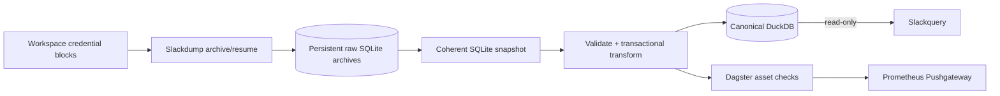

<div align="center">

# Slackpipe

### Local-first Slack archival and canonicalization

[](https://www.python.org/)
[](https://duckdb.org/)
[](https://dagster.io/)
[](compose.yaml)
[](LICENSE)

[Documentation](https://github.com/thomasmaerz/slackpipe/wiki) ·
[Operations](docs/operations.md) ·
[Sister project: Slackquery](https://github.com/thomasmaerz/slackquery)

</div>

Slackpipe archives multiple Slack workspaces through
[Slackdump](https://github.com/rusq/slackdump), converts coherent snapshots into
one transactional DuckDB database, and orchestrates the complete lifecycle with
Dagster. Raw archives stay local, credentials never enter Dagster metadata, and
downstream systems consume the canonical database read-only.

## Why Slackpipe

- **Multi-workspace:** discover repeated workspace credential blocks and create
  isolated assets, jobs, checks, and schedules for each workspace.
- **Resumable extraction:** choose initial archive or incremental resume plans,
  bound stale rescans, and serialize Slackdump access with advisory locks.
- **Attachment integrity:** reconcile downloaded files against source metadata,
  record exact local object paths, and surface missing or mismatched bytes.
- **Coherent snapshots:** use SQLite's backup API instead of copying a live WAL
  database directly.
- **Canonical DuckDB:** transactionally upsert workspaces, channels, users,
  messages, reactions, files, events, checkpoints, and lineage.
- **Proof before trust:** compare source and canonical key sets, row counts,
  hashes, thread completeness, attachment coverage, and latest timestamps.
- **Production orchestration:** Dagster assets, blocking checks, schedules,
  rollout sensors, retries, concurrency limits, PostgreSQL state, and metrics.
- **Safe compaction:** compact raw SQLite archives offline, verify semantic
  equivalence, then rebase checkpoints only after proof succeeds.

## Architecture



Slackpipe owns extraction and canonical data. Its sister project
[Slackquery](https://github.com/thomasmaerz/slackquery) owns search projection,
embeddings, immutable search artifacts, and MCP retrieval. The included Compose
stack can load both as separate Dagster code locations.

## Quickstart

### Prerequisites

- Docker with Compose
- `uv` for local development
- Slack workspace credentials compatible with Slackdump
- enough durable storage for raw archives, attachments, DuckDB, and Dagster logs

### 1. Configure workspace credentials

```bash
cp .env.example .env
chmod 600 .env
```

Repeat this block for each workspace:

```dotenv
WORKSPACE=Example Workspace
CHANNEL_URL=https://example-workspace.slack.com
SLACK_TOKEN=<replace-with-slack-token>
SLACK_COOKIE=<replace-with-slack-cookie>
```

Never commit the credential file. Slack tokens and cookies are excluded from
object representations and orchestration metadata.

### 2. Configure deployment values

```bash
cp deployment.env.example deployment.env
chmod 600 deployment.env
```

Set a strong PostgreSQL password and review all bind paths. Loopback is the
public default for exposed ports.

### 3. Start the stack

```bash
docker compose --env-file deployment.env up -d --build
```

Open Dagster at `http://127.0.0.1:3000`, inspect the generated workspace jobs,
then launch `<workspace_slug>_ingest_once`. Initial ingestion never enables
stale skipping. Start recurring schedules only after the initial run and checks
succeed.

## Pipeline stages

1. **Discover** workspace blocks and validate identities, URLs, and credentials.
2. **Extract** with Slackdump `archive` or `resume` under a global lock.
3. **Reconcile attachments** and record local paths and observed byte counts.
4. **Snapshot** the live SQLite archive through the SQLite backup API.
5. **Transform** into DuckDB under a transaction and writer lock.
6. **Verify** source/canonical equality and lineage invariants.
7. **Observe** by publishing bounded latest-run metrics to Pushgateway.

## Dagster surface

Each managed workspace receives assets for raw extraction, attachments, and the
canonical database, plus blocking checks for archive, attachment, and canonical
integrity. The definitions also expose:

- per-workspace initial and incremental jobs;
- all-workspaces extract and canonical rollout jobs;
- `slackpipe_new_workspace_sensor` for newly discovered workspaces;
- `slackpipe_attachments_and_duckdb_coordinator` for serialized
  extract/attachment/canonical progression;
- `slackpipe_run_failure_metrics` for failure observability;
- stopped-by-default schedules so activation remains an operator decision.

## Canonical schema

The canonical DuckDB includes:

- `schema_metadata`
- `ingestion_runs`
- `source_archives`
- `ingestion_checkpoints`
- `workspaces`
- `channels`
- `users`
- `channel_members`
- `messages`
- `reactions`
- `files`
- `message_events`
- `attachment_backfills`
- `document_chunks`

The source archive is validated before writes begin. Canonical mutation occurs
inside one transaction, and failed verification rolls back publication of new
state.

## Development

```bash
uv sync --all-extras
uv run pytest -q
```

The suite covers workspace parsing, Slackdump planning and failures, locks,
snapshot behavior, canonical transforms, lineage, compaction, metrics, Dagster
orchestration, and deployment contracts.

## Security model

- Credentials remain in ignored files or secret mounts.
- Raw archives, attachments, and canonical databases are ignored.
- Slackdump subprocess output is redacted before errors are surfaced.
- Lock files prevent concurrent mutation of raw archives and DuckDB.
- Downstream consumers mount canonical data read-only.
- Dagster and Pushgateway should remain private or sit behind an authenticated
  reverse proxy.

See [SECURITY.md](SECURITY.md) and the
[operations runbook](docs/operations.md) before production use.

## Project status

Slackpipe has automated unit, integration, orchestration, security, and
deployment-contract coverage. Archive completeness still depends on Slack API
visibility, supplied credentials, retention, and Slackdump behavior; successful
execution is not a claim that Slack exposed data it did not authorize.

## License

[MIT](LICENSE)
